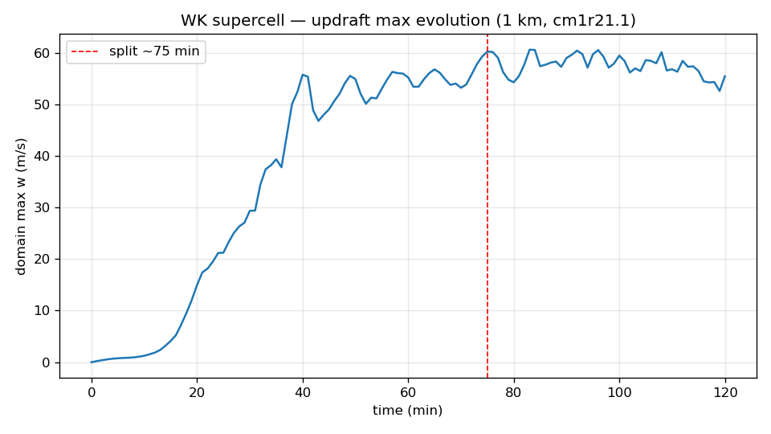
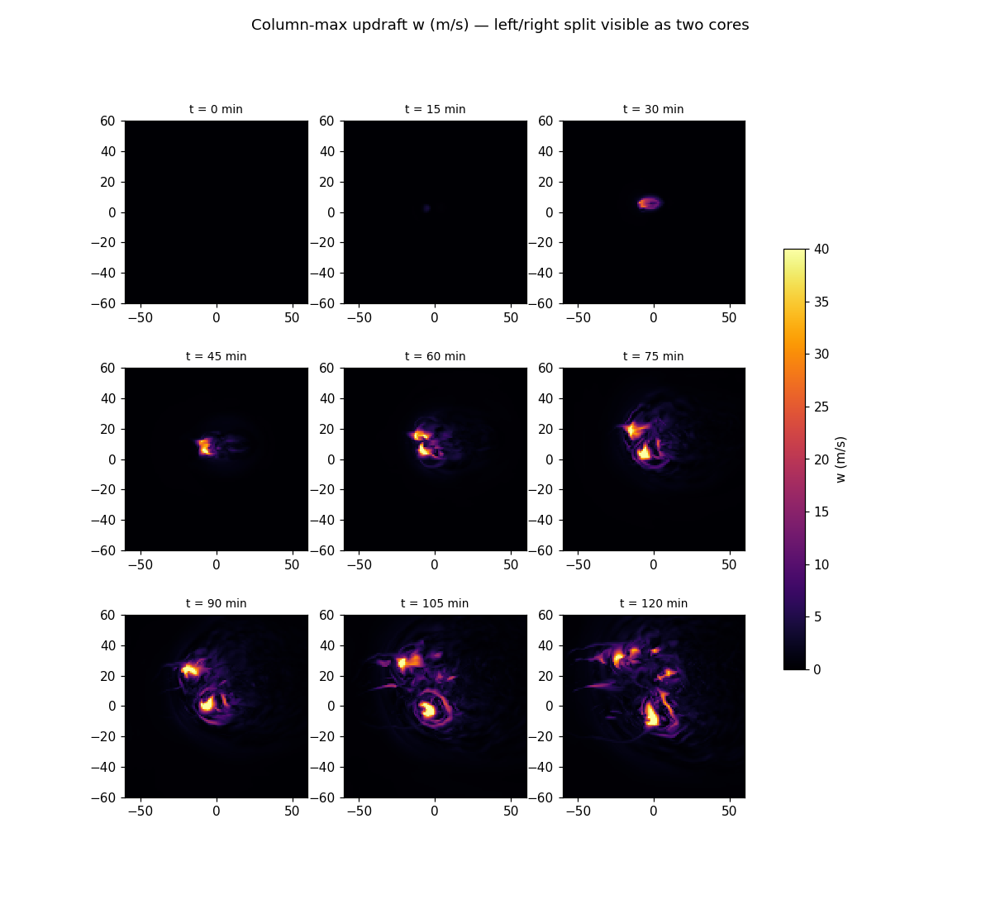

# Phase 0 — Weisman–Klemp supercell validation

**Result: PASS.** CM1 cm1r21.1 reproduces the canonical Weisman–Klemp supercell
evolution — deep sustained updraft, storm splitting into counter-rotating
left/right movers, mesocyclone-scale rotation. "It ran" *and* "it's right".

See build provenance in [phase0-cm1-build.md](phase0-cm1-build.md).

## What was run

- **Deck:** CM1's bundled `run/config_files/supercell` (the canonical WK case),
  preserved verbatim at [`sim/validation/namelist.input`](../sim/validation/namelist.input).
  Weisman–Klemp analytic sounding (`isnd=5`), unidirectional shear (`iwnd=2`),
  single warm bubble (`iinit=1`), **no random perturbations (`irandp=0`)**,
  moving domain (`imove=1`, Bunkers `umove=12.5, vmove=3.0`), Morrison 2-moment
  microphysics (`ptype=5`), `psolver=3`.
- **Grid:** 120 × 120 × 40, dx=dy=1000 m, dz=500 m (uniform), ztop=18 km.
  Domain 120 × 120 km, centered (`iorigin=2`). 2 h storm time, `dtl=6 s`.
- **Output:** `output_format=2` (netCDF), `output_filetype=1` (single `cm1out.nc`,
  9 frames at 15 min), plus `cm1out_stats.nc` (domain diagnostics every 60 s).
- **Run:** `mpirun -np 8 ./cm1.exe`, clean machine, wall time **3 min 24 s**.

## Metrics (the two charter-named validation targets + rotation)

### 1. Updraft-max evolution — 

| t (min) | 30 | 60 | 90 | 120 | peak |
|---|---|---|---|---|---|
| domain max w (m/s) | 29.3 | 55.2 | 59.0 | 55.4 | **60.6 @ 83 min** (z=10.5 km) |

Life cycle: quiescent to ~15 min → rapid intensification 15–40 min → brief dip
at ~40–45 min (**the updraft splitting and briefly weakening — the classic split
signature**) → sustained quasi-steady mature phase oscillating 50–60 m/s for 80+
min. Sustained longevity is itself a supercell signature (ordinary cells decay).

> **Caveat (watch in benchmark):** peak w = 60.6 m/s is on the high side — parcel
> theory with realistic dilution for this CAPE gives ~40–50 m/s. This is expected
> at 1 km: entrainment is under-resolved so updrafts run strong. If 500 m gives
> visibly weaker updrafts that is entrainment converging, **not** a bug.

### 2. Storm splitting — 

Column-max updraft `w` per frame. Single cell through 30–60 min; splits into two
cores that diverge monotonically in the cross-shear (y) direction:

| t (min) | 30–60 | 75 | 90 | 105 | 120 |
|---|---|---|---|---|---|
| distinct updraft cores | 1 | 2 | 2 | 2+ | 5 |
| core separation (km) | — | 17.9 | 27.3 | 29.7 | 46.3 |

**Split underway ~40 min** (the wmax dip); connected-component detection first
resolves two *separated* cores (17.9 km apart) at **75 min**. Why this is
unambiguously a split and not independent cells: the deck starts from a *single*
warm bubble with `irandp=0`, so two diverging cores can only arise by splitting.

### 3. Counter-rotating pair (mesocyclones) — signed mid-level ζ at each core

Peak signed vertical vorticity (5 km AGL) in each core's neighborhood:

| t (min) | central/tracked mover | northward mover | |
|---|---|---|---|
| 75 | −0.022 | +0.024 | opposite ✓ |
| 90 | −0.029 | +0.027 | opposite ✓ |
| 105 | −0.027 | +0.024 | opposite ✓ |

Two counter-rotating mesocyclones, |ζ| ≈ 0.022–0.029 s⁻¹ — the defining WK split
diagnostic. (By 120 min secondary cells appear; the two *strongest* cores are no
longer the original pair, so that frame is not a clean pair sample.) The specific
sign↔direction mapping depends on hodograph/coordinate orientation; what matters
is the opposite-sign couplet.

## On the "published reference" question

There is no golden cm1r21.1-supercell output to match numerically, and WK82 used
a different model, resolution, and (ice-free) microphysics — an exact-number match
is neither available nor expected. **Signature-level agreement is the reference
comparison** for this case: initiation → splitting → counter-rotating diverging
movers → sustained deep rotating updraft, all with magnitudes in the WK range.

## Reproduce

```
cd /home/boiko/thunderstorm/runs/validation   # deck = sim/validation/namelist.input
mpirun -np 8 ./cm1.exe                          # -> cm1out.nc, cm1out_stats.nc
python3 analyze.py          # updraft evolution, split timing, figures
python3 check_rotation.py   # signed-zvort counter-rotating pair
```

Analysis scripts: [`sim/validation/analyze.py`](../sim/validation/analyze.py),
[`sim/validation/check_rotation.py`](../sim/validation/check_rotation.py).
Binary: `cm1.exe` sha256 `5da2c2aa…b016bd` (see build doc).
